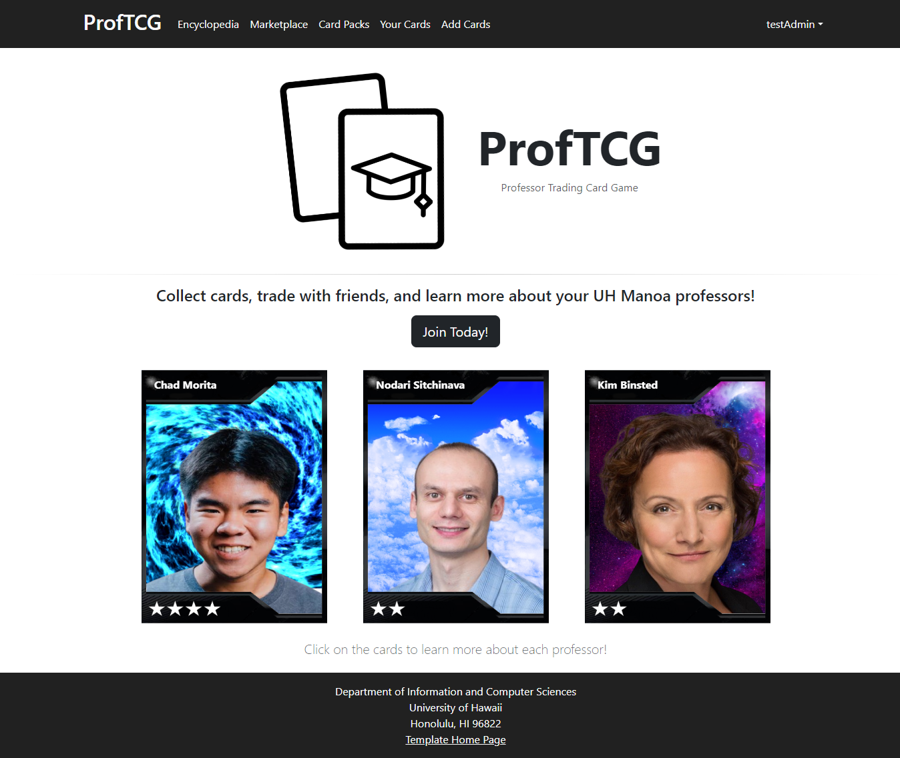

A professor trading card game for the University of Hawaii at Manoa.

## Table of Contents

- [Overview](#overview)
- [User Guide](#user-guide)
- [Community Feedback](#community-feedback)
- [Developer Guide](#developer-guide)
- [Continuous Integration](#continuous-integration)
- [Deployment](#deployment)
- [Development History](#development-history)
- [Contact Us](#contact-us)

## Overview

### The Problem

Many students experience a sense of disconnection from their professors, whether it be due to large class sizes or even just a lack of personal interaction in small classes. Moreover, many are interested in learning more about their professors and have questions about what they are researching and the projects they are working on. However, it can be difficult to network and make connections with professors and ask those questions directly.

### The Solution

Trading card games are very popular, and this neat twist involves the UH Manoa community and fosters a sense of belonging at the institution. It encourages students to make friends and bond with their classmates as well. Every 24 hours, students can open a card pack to receive a new trading card containing fun facts about their professor. Each trading card is unique to that semester and limited based on class size, thus encouraging students to collect trading cards of varying styles and rarity. Learning more about their research and projects may inspire students interested in conducting their own research and projects to come up with ideas and seek out potential mentors.

Link to GitHub organization: [ProfTCG](https://github.com/proftcg)

Link to team contract: [Team Contract](https://docs.google.com/document/d/13R-WpDwe0qNQMwgf0Ye_BV3I-foe-L_i/edit?usp=sharing&ouid=105648329603709146662&rtpof=true&sd=true)

## User Guide

This section provides an overview of the ProfTCG interface (available at https://proftcg.me).

<h3 style="font-weight:bold; margin-top:48px; text-align:center">Landing Page</h3>

The landing page is first displayed to you upon visiting the top-level site URL. A randomized display of a few cards is available and are clickable.

<h3 style="font-weight:bold; margin-top:48px; text-align:center">Card Encyclopedia Page</h3>

A prospective user may want to look through the rest of our encyclopedia of cards to see our other interesting cards before signing up. Each card has a rarity, as well as a name and image associated with a professor in our ICS department.

<h3 style="font-weight:bold; margin-top:48px; text-align:center">Sign-Up Page</h3>

After getting an overview of the amazing cards you can collect, you'll be eager to sign up here!

<h3 style="font-weight:bold; margin-top:48px; text-align:center">Sign-In Page</h3>

And when you come back to trade more cards, signing in will be just as easy.

<h3 style="font-weight:bold; margin-top:48px; text-align:center">Home Page (User)</h3>

Upon signing in, you'll be presented with additional functionality in the navigation bar at the top. There is a marketplace for trading cards, a page for opening card packs, and a display of the cards in your collection.

<h3 style="font-weight:bold; margin-top:48px; text-align:center">Home Page (Admin)</h3>

Admins get an extra Add Cards feature - we'll take a look at that later.

<h3 style="font-weight:bold; margin-top:48px; text-align:center">Card Marketplace Page</h3>

In the marketplace, a list of all the cards other users have put up for trade can be explored. You can take anyone up on their trade offer so long as your card has at least the same rarity as theirs.

This is what it looks like after clicking Request Trade.

<h3 style="font-weight:bold; margin-top:48px; text-align:center">Card Pack Page</h3>

Here you can open card packs. Currently, the only pack available is a Standard Pack, which can be opened once daily. It contains one card of any rarity.

<h3 style="font-weight:bold; margin-top:48px; text-align:center">Your Cards Page</h3>

Here your cards are displayed, sorted by rarity. So far, testJohn has only opened one card pack, so his only card is present within. Hopefully he can build up a better collection in the future!

Every card - the ones on the landing page, home page, encyclopedia, and marketplace - can be clicked to open a text description containing colorful and informative tidbits that are interesting, relevant to one's studies, and sometimes, hopefully, funny.

<h3 style="font-weight:bold; margin-top:48px; text-align:center">Add Cards Page (Admin)</h3>

Finally, we reach the special Admin Only feature - Add Cards. Here, an admin account can select a valid professor from our listing, assign the card a rarity and back description, and choose how many cards of that type are created (to then be opened in a card pack).

As you can see, so far we have only implemented UH Manoa ICS professors.

<h3 style="font-weight:bold; margin-top:48px; text-align:center">Sign-Out Page</h3>

We welcome you to come back soon upon signing out with a friendly .gif. Sadly, he does not move in this screenshot...

## Community Feedback
We asked users to test our deployed application and provide feedback on their experience. Here's a summary of what they said.

**Likes**:
- Users liked the project and the concept behind it. 
- Some users found the descriptions interesting.
- Users liked the visuals as well.

**Dislikes**:
- Users did not like the custom cursor design.
- Some users reported that card descriptions overlapped with card previews on certain screen sizes/aspect ratios.
- Others felt they should receive more than one card per day.

**Navigation**:
- Users found the site to be easy to navigate, giving an average rating of 4/5 (1 being poor, 5 being excellent).

**Recommendation**:
- On average, users were not willing to recommend the site to others, giving an average rating of 2/5 (1 being not at all likely, 5 being extremely likely).

**Suggestions for Future Updates**:
- Use a normal cursor
  - The current cursor is too distracting for many users
- Build user base
  - As this is a community-driven app, the user base is currently too small for features like trading to work optimally
- Add more features
  - Currently, the making features of the app are trading and collecting
  - More features like a leaderboard, game aspect, or the ability to view other users' collections could enhance the user experience

## Developer Guide

### Downloading

- Visit [https://github.com/ProfTCG/proftcg](https://github.com/ProfTCG/proftcg)
- If making edits to the project:
  - Create a new branch named `Issue-XX` (where "XX" is the issue you are addressing on the project board)
- Clone the repository to your machine via the method of your choice

### Installing

- Open the branch in the IDE or text editor of your choice
- If opening the project for the first time:
  - Open a terminal instance
  - Navigate to your repository
  - Navigate to the `app` folder
  - Run the following command to install dependencies: `meteor npm install`

### Running

- Open a terminal instance
- Navigate to your repository
- Navigate to the `app` folder
- Optional: Reset the project database with `meteor reset`
- Run the following command to run the application on your machine: `meteor npm run start`

### Modifying and Testing

- Make all changes on your machine (in the `Issue-XX` branch from earlier)
- Open a terminal instance
- Navigate to your repository
- Navigate to the `app` folder
- Run the following command to detect formatting errors: `npm run lint`
  - Fix any errors that pop up
  - Once formatting is correct, the ESLint should run without generating any errors
- Run the following command to ensure that page functionality still works as expected: `meteor npm run testcafe`
  - Ensure that your branch passes all tests

### Publishing Changes

- After successfully completing the previous step:
  - Commit your changes to your branch via the method of your choice
  - Optional: Create a pull request and wait for another developer to review your changes before merging your branch into `main`

## Continuous Integration

ProfTCG uses [GitHub Actions](https://docs.github.com/en/free-pro-team@latest/actions) to automatically run ESLint and TestCafe each time a commit is made to the default branch.  You can see the results of all recent "workflows" at [https://github.com/profctg/proftcg/actions](https://github.com/proftcg/proftcg/actions).

The workflow definition file is quite simple and is located at
[.github/workflows/ci.yml](https://github.com/proftcg/proftcg/blob/main/.github/workflows/ci.yml).

## Deployment

Link to deployed application: [https://proftcg.me](https://proftcg.me)

## Development History

The development process for ProfTCG conformed to Issue Driven Project Management practices. In a nutshell:

- Development consists of a sequence of Milestones.
- Each Milestone is specified as a set of tasks.
- Each task is described using a GitHub Issue, and is assigned to a single developer to complete.
- Tasks should typically consist of work that can be completed in 2-4 days.
- The work for each task is accomplished with a git branch named `Issue-XX`, where "XX" is replaced by the issue number.
- When a task is complete, its corresponding issue is closed and its corresponding git branch is merged into master.
- The state (todo, in progress, complete) of each task for a milestone is managed using a GitHub Project Board.
- The following sections document the development history of ProfTCGs.

### Milestone 1: Mockup development

The goal of Milestone 1 was to create mockups of the pages in the system.

Milestone 1 was managed using [ProfTCG GitHub Project Board M1](https://github.com/orgs/ProfTCG/projects/3).

### Milestone 2: Improve functionality and quality

The goal of Milestone 2 was to implement our planned pages and improve the functionality and quality of the application.

Milestone 2 was managed using [ProfTCG GitHub Project Board 2](https://github.com/orgs/ProfTCG/projects/4).

### Milestone 3: Add data and open project to public testing

The goal of Milestone 3 is to significantly improve the functionality of the application, incorporate a significant amount of "real" data, and solicit feedback rom "real" users.

Milestone 3 was managed using [ProfTCG GitHub Project Board 3](https://github.com/orgs/ProfTCG/projects/5/views/1).

## Contact Us

ProfTCG is developed by UH Manoa ICS students [Kent Burgess](https://github.com/KentHB), [Lucas Horsman](https://github.com/lucashorsman), [Donald Lipps](https://github.com/lippsd), [Samantha Mallari](https://github.com/samallari), and [Ethan Morrell](https://github.com/EthanMorrell).
