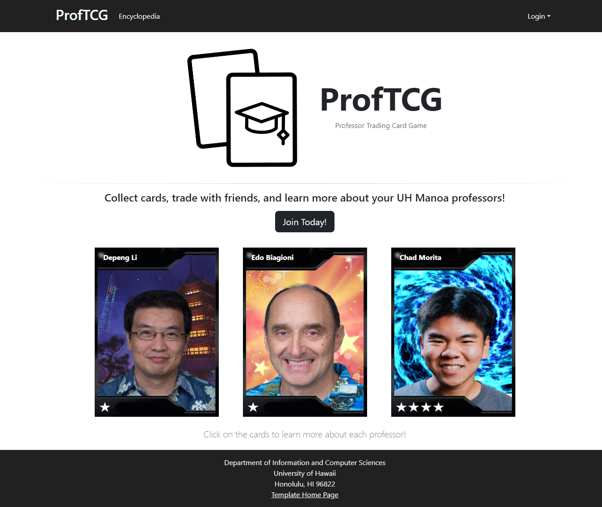
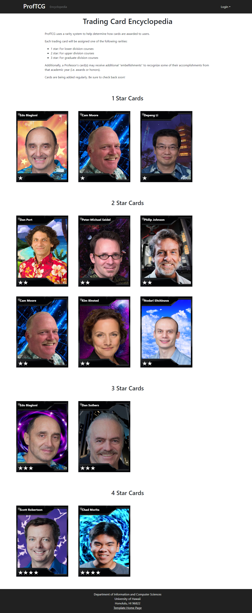

# ProfTCG
A professor trading card game for the University of Hawaii at Manoa.

## Table of Contents
- [Overview](#overview)
- [User Guide](#user-guide)
- [Pages](#mockups)
- [Development History](#development-history)
- [Deployment](#deployment)
- [Contact Us](#contact-us)

## Overview
### The problem
Many students experience a sense of disconnection from their professors, whether it be due to large class sizes or even just a lack of personal interaction in small classes. Moreover, many are interested in learning more about their professors and have questions about what they are researching and the projects they are working on. However, it can be difficult to network and make connections with professors and ask those questions directly.

### The solution
Trading card games are very popular, and this neat twist involves the UH Manoa community and fosters a sense of belonging at the institution. It encourages students to make friends and bond with their classmates as well. During the semester, students can input courses to receive a trading card containing fun facts about their professor. Each trading card is unique to that semester and limited based on class size, thus encouraging students to collect trading cards of varying styles and rarity. Learning more about their research and projects may inspire students interested in conducting their own research and projects to come up with ideas and seek out potential mentors.

Link to GitHub organization: [ProfTCG](https://github.com/proftcg)

Link to team contract: [Team Contract](https://docs.google.com/document/d/13R-WpDwe0qNQMwgf0Ye_BV3I-foe-L_i/edit?usp=sharing&ouid=105648329603709146662&rtpof=true&sd=true)

## User Guide
### Mockups
Planned Pages:
- Home/Landing
- Sign-in/Sign-up
- User Inventory
- Card Encyclopedia
- Card Marketplace

Landing Page

Home Page (User)

Home Page (Admin)

Encyclopedia Page

Sign-In Page

Sign-Out Page

At the time of writing, the other page mockups are still under revision by the development team.

## Development History
The development process for ProfTCG conformed to Issue Driven Project Management practices. In a nutshell:

- Development consists of a sequence of Milestones.
- Each Milestone is specified as a set of tasks.
- Each task is described using a GitHub Issue, and is assigned to a single developer to complete.
- Tasks should typically consist of work that can be completed in 2-4 days.
- The work for each task is accomplished with a git branch named "issue-XX", where XX is replaced by the issue number.
- When a task is complete, its corresponding issue is closed and its corresponding git branch is merged into master.
- The state (todo, in progress, complete) of each task for a milestone is managed using a GitHub Project Board.
- The following sections document the development history of ProfTCGs.

### Milestone 1: Mockup development
The goal of Milestone 1 was to create mockups of the pages in the system.

Milestone 1 was managed using [ProfTCG GitHub Project Board M1](https://github.com/orgs/ProfTCG/projects/3).

### Milestone 2: Improve functionality and quality
The goal of Milestone 2 is to improve the functionality and quality of the application.

Milestone 2 was managed using [ProfTCG Github Project Board 2](https://github.com/orgs/ProfTCG/projects/4).

## Deployment
Link to deployed application: [https://proftcg.me](https://proftcg.me)

## Contact Us
ProfTCG is developed by UH Manoa ICS students [Kent Burgess](https://github.com/KentHB), [Lucas Horsman](https://github.com/lucashorsman), [Donald Lipps](https://github.com/lippsd), [Samantha Mallari](https://github.com/samallari), and [Ethan Morrell](https://github.com/EthanMorrell). 
