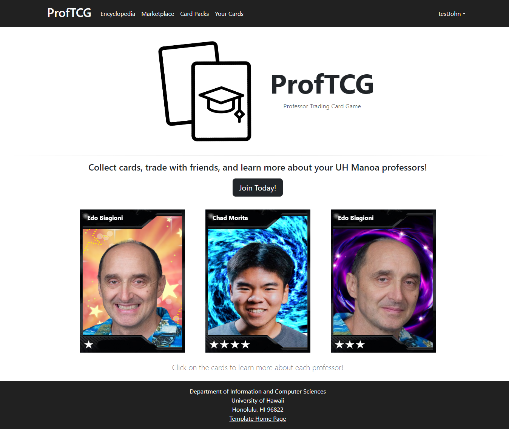

# ProfTCG

A professor trading card game for the University of Hawaii at Manoa.

## Table of Contents

- [Overview](#overview)
- [User Guide](#user-guide)
- [Developer Guide](#developer-guide)
- [Continuous Integration](#continuous-integration)
- [Deployment](#deployment)
- [Development History](#development-history)
- [Contact Us](#contact-us)

## Overview

### The Problem

Many students experience a sense of disconnection from their professors, whether it be due to large class sizes or even just a lack of personal interaction in small classes. Moreover, many are interested in learning more about their professors and have questions about what they are researching and the projects they are working on. However, it can be difficult to network and make connections with professors and ask those questions directly.

### The Solution

Trading card games are very popular, and this neat twist involves the UH Manoa community and fosters a sense of belonging at the institution. It encourages students to make friends and bond with their classmates as well. During the semester, students can input courses to receive a trading card containing fun facts about their professor. Each trading card is unique to that semester and limited based on class size, thus encouraging students to collect trading cards of varying styles and rarity. Learning more about their research and projects may inspire students interested in conducting their own research and projects to come up with ideas and seek out potential mentors.

Link to GitHub organization: [ProfTCG](https://github.com/proftcg)

Link to team contract: [Team Contract](https://docs.google.com/document/d/13R-WpDwe0qNQMwgf0Ye_BV3I-foe-L_i/edit?usp=sharing&ouid=105648329603709146662&rtpof=true&sd=true)

## User Guide

This section provides an overview of the ProfTCG interface (available at https://proftcg.me).

<h3 style="font-weight: bold; text-align: center">Landing Page</h3>

<h3 style="font-weight: bold; text-align: center">Home Page (User)</h3>

<h3 style="font-weight: bold; text-align: center">Home Page (Admin)</h3>

<h3 style="font-weight: bold; text-align: center">Encyclopedia Page</h3>

<h3 style="font-weight: bold; text-align: center">Sign-In Page<h3/>

<h3 style="font-weight: bold; text-align: center">Sign-Out Page</h3>

## Developer Guide

### Downloading

- Visit https://github.com/ProfTCG/proftcg
- If making edits to the project:
  - Create a new branch named `Issue-XX` (where "XX" is the issue you are addressing on the project board)
- Clone the repository to your machine via the method of your choice

### Installing

- Open the branch in the IDE or text editor of your choice
- If opening the project for the first time:
  - Open a terminal instance
  - Navigate to your repository
  - Navigate to the `app` folder
  - Run the following command to install dependencies: `meteor npm install`

### Running

- Open a terminal instance
- Navigate to your repository
- Navigate to the `app` folder
- Optional: Reset the project database with `meteor reset`
- Run the following command to run the application on your machine: `meteor npm run start`

### Modifying and Testing

- Make all changes on your machine (in the `Issue-XX` branch from earlier)
- Open a terminal instance
- Navigate to your repository
- Navigate to the `app` folder
- Run the following command to detect formatting errors: `npm run lint`
  - Fix any errors that pop up
  - Once formatting is correct, the ESLint should run without generating any errors
- Run the following command to ensure that page functionality still works as expected: `meteor npm run testcafe`
  - Ensure that your branch passes all tests

### Publishing Changes

- After successfully completing the previous step:
  - Commit your changes to your branch via the method of your choice
  - Optional: Create a pull request and wait for another developer to review your changes before merging your branch into `main`

## Continuous Integration

ProfTCG uses [GitHub Actions](https://docs.github.com/en/free-pro-team@latest/actions) to automatically run ESLint and TestCafe each time a commit is made to the default branch.  You can see the results of all recent "workflows" at [https://github.com/profctg/proftcg/actions](https://github.com/proftcg/proftcg/actions).

The workflow definition file is quite simple and is located at
[.github/workflows/ci.yml](https://github.com/proftcg/proftcg/blob/main/.github/workflows/ci.yml).

## Deployment

Link to deployed application: [https://proftcg.me](https://proftcg.me)

## Development History

The development process for ProfTCG conformed to Issue Driven Project Management practices. In a nutshell:

- Development consists of a sequence of Milestones.
- Each Milestone is specified as a set of tasks.
- Each task is described using a GitHub Issue, and is assigned to a single developer to complete.
- Tasks should typically consist of work that can be completed in 2-4 days.
- The work for each task is accomplished with a git branch named `Issue-XX`, where "XX" is replaced by the issue number.
- When a task is complete, its corresponding issue is closed and its corresponding git branch is merged into master.
- The state (todo, in progress, complete) of each task for a milestone is managed using a GitHub Project Board.
- The following sections document the development history of ProfTCGs.

### Milestone 1: Mockup development

The goal of Milestone 1 was to create mockups of the pages in the system.

Milestone 1 was managed using [ProfTCG GitHub Project Board M1](https://github.com/orgs/ProfTCG/projects/3).

### Milestone 2: Improve functionality and quality

The goal of Milestone 2 was to implement our planned pages and improve the functionality and quality of the application.

Milestone 2 was managed using [ProfTCG GitHub Project Board 2](https://github.com/orgs/ProfTCG/projects/4).

### Milestone 3: Add data and open project to public testing

The goal of Milestone 3 is to significantly improve the functionality of the application, incorporate a significant amount of "real" data, and solicit feedback rom "real" users.

Milestone 3 was managed using [ProfTCG GitHub Project Board 3](https://github.com/orgs/ProfTCG/projects/5/views/1).

## Contact Us

ProfTCG is developed by UH Manoa ICS students [Kent Burgess](https://github.com/KentHB), [Lucas Horsman](https://github.com/lucashorsman), [Donald Lipps](https://github.com/lippsd), [Samantha Mallari](https://github.com/samallari), and [Ethan Morrell](https://github.com/EthanMorrell).

